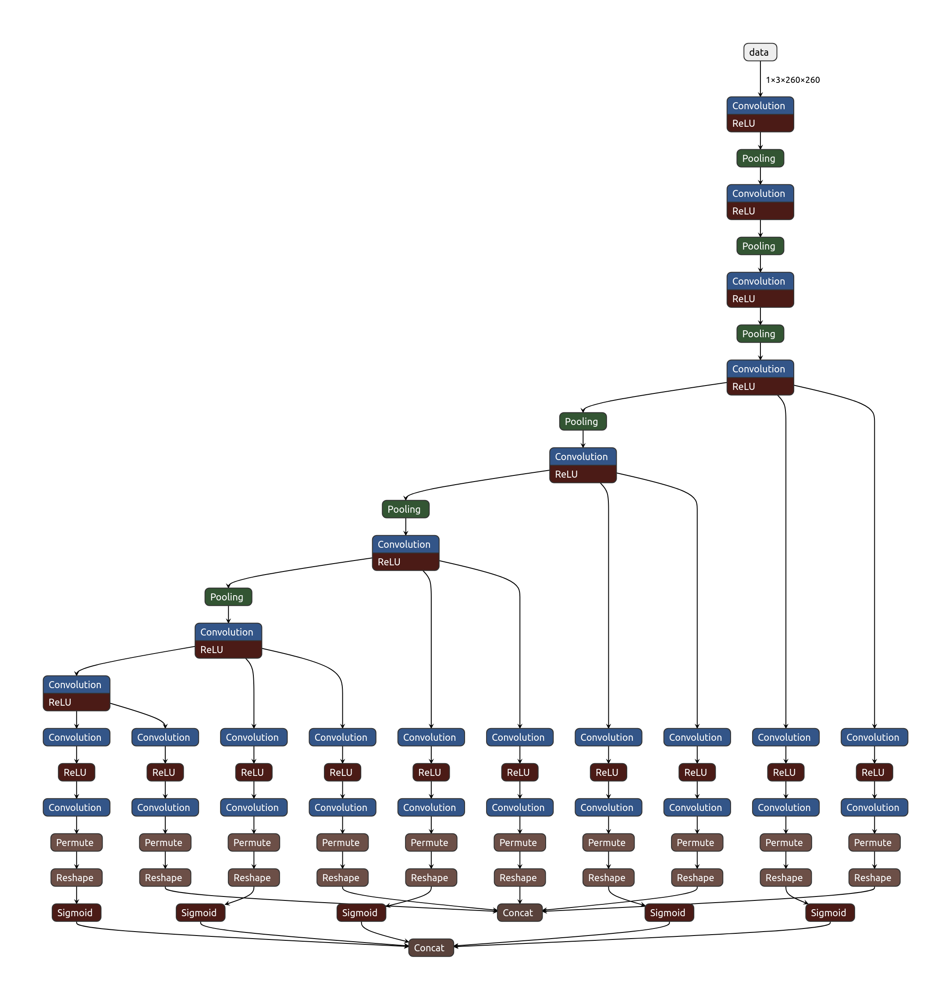

# FaceMaskDetection for Mac and Raspberry using Tensorflow Lite

  

### We open source all the popular deep learning frameworks' model and inference code to do face mask detection.

### Please give link to these repository when used

It from https://github.com/AIZOOTech/FaceMaskDetection

-  [x] TensorFlow（include tflite and pb model）
- Detect faces and determine whether they are wearing mask.
- Updated to record image when some people not use mask and send to slack channel
- First of all, we hope the people in the world defeat COVID-2019 as soon as possible. Stay strong, all the countries in the world.**
- We make face mask detection models with five mainstream deep learning frameworks （TensorFlow） open sourced, and the corresponding inference codes.

  

## How to use

- git clone these repository

- create virtual environment -> `virtualenv facemask`

- activate virtual environemnt -> `source facemask/bin/activate`

- copy env -> `cp .env.staging .env`

- update env value with slack channel and slack token

- install requirements depends on raspberry or mac -> `pip3 install -r requirements_mac.txt`

- run application -> `python3 tensorflow_infer.py --img-mode 0 --video-path 0`

  

## Model structure

  

We used the structure of SSD. However, in order to make it run quickly in the browser, the backbone network is lite. The total model only has 1.01M parametes.

  

Input size of the model is 260x260, the backbone network only has 8 conv layers. The total model has only 24 layers with the location and classification layers counted.

  

SSD anchor configurtion is show bellow:

  

| multibox layers | feature map size | anchor size | aspect ratio）|

| ---- | ---- | ---- | ---- |

|First|33x33|0.04,0.056|1,0.62,0.42|

Second ||17x17|0.08,0.11|1,0.62,0.42|

|Third|9x9|0.16,0.22|1,0.62,0.42|

|Forth |5x5|0.32,0.45|1,0.62,0.42|

|Fifth|3x3|0.64,0.72|1,0.62,0.42|

  

## How to run

### TensorFlow

on image：

```

python3 tensorflow_infer.py --img-path /path/to/your/img

```

on video：

```

python3 tensorflow_infer.py --img-mode 0 --video-path /path/to/video

# If you want to run with camera video, set video_path to be 0

python3 tensorflow_infer.py --img-mode 0 --video-path 0

```

  

## Appendix

### Feedback

Submit PR

  
  

### Model structure

  

We merge the BN to Conv layers in order to accelerate the inference speed.

  



  

### Testset PR curve

  

